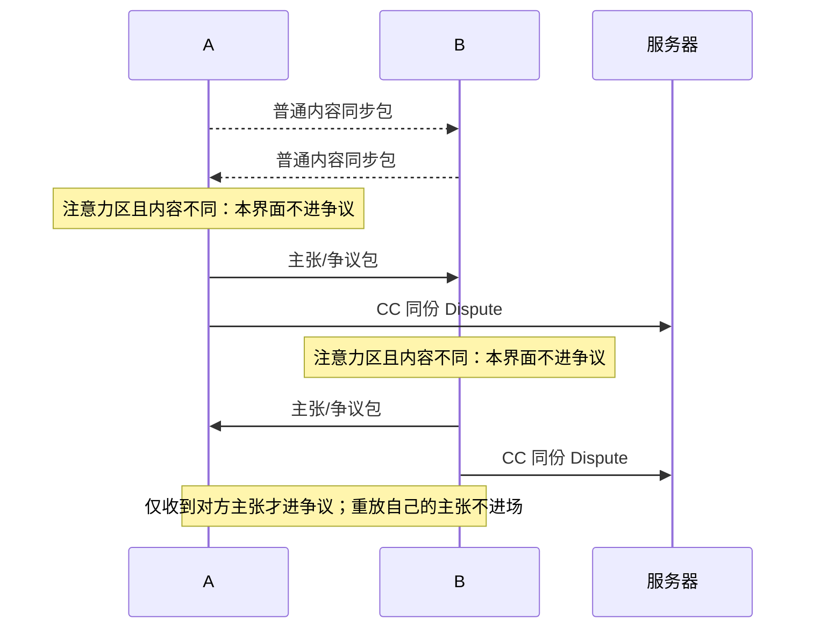

# 协同编辑器（共享文档）项目设计

## 核心需求

- 多人在线实时编辑文本/md/代码
- 显示每个人的编辑光标与选中
- 服务器P2P打洞或转发确保实时性（优先打洞直连，再转发）
  - 只P2P光标等高度实时、准确度要求不高的部分
  - 主张和追随要留下来，走转发，得送到
- 无锁行级争议处理（共同编辑）
- 一致性目标是最终收敛：普通编辑在传输途中可暂时不同；各端收到当前链表与已申报主张后逐步收敛。未解决争议时允许各自保留本人正文视角，追随收口后收敛到选定结果，不要求所有客户端在每个瞬间采用同一操作顺序

## 无锁行级争议处理

### 为何不锁

人类写文档是有心流的，当我对那边有想法时，别人刚好也有。此时应该保留各自心流，而非打断

### 争议从哪来

我认为这处该这样，你认为该那样，这处就有争议。这是人和人之间的事，不是服务器判出来的。

必须区分两类消息：

- **普通内容同步包**：同步正文变更。收到后按本地规则决定是直接应用，还是仅触发「向外发主张」；**不得**把普通内容同步包直接显示成争议候选。
- **主张 / 争议包**：独立消息，载荷即既有 `model.Dispute`（每人一份）。只有它才会让**对方**进入争议 UI。

#### 单切面时序（规范性）

1. A 编辑一份内容；B 在同一行编辑。各自的输入先成为自己眼中的正文，并发出普通内容同步包。
2. A 收到 B 的普通内容同步：发现 B 改了自己当前活跃输入光标所在行，且结果与自己的正文不同。A 保持自己的正文，**不在本界面进入争议**；A 向 B 发出自己认为该处应如何的主张包，同时 CC 服务器。
3. B 收到 A 的普通内容同步时独立做同样的判断：保持自己的正文，**不在本界面进入争议**；B 向 A 发出自己的主张包，同时 CC 服务器。两端谁先完成同步或发包不影响规则。
4. A 收到 B 的主张包、B 收到 A 的主张包时，各自才把对方的主张与自己当前的正文一起显示为争议。客户端按稳定主张 ID 幂等合并；自己发出的主张，以及服务器重放自己的主张，都不会让自己进入争议。
5. 尚无别人的主张时：输入、回车、删行都是普通正文操作，只走普通内容同步包。
6. 本端没在该行保持注意力，或双方该处内容相同：本端不发主张 / 争议包；兼容的普通内容同步直接应用进来。
7. 离线重连后，服务器下发当前正式行链与已记录的主张；客户端保全本地待发送修改，按同一注意力规则整合正文。重放他人的主张按稳定 ID 幂等，自己的主张不让自己进争议。
8. 服务器只转发并持久化客户端 CC 过来的既有 `model.Dispute`（每人一份）；不自行根据 `afterSeen` / `baseContent` / 光标位置生成争议，也不仲裁谁对。

单端判定只有两步：**收到普通内容同步 → 注意力区内容不同则发出自己的主张；收到他人的主张 → 自己进入争议。** 发出主张本身不改变本端争议视图。自己的包（含服务器回放自己）在接收侧被识别为本人主张并忽略进场，故一人无法对自己开争议。

要点补充：

- 我只改我本地的。对方发来的普通内容同步，不拿去盖掉我自己的注意力区主张
- 我这份主张 / 争议包发出去，才是我的主张；普通内容同步包本身不是争议
- 本端收到一份该处的**他人**主张，就用自己当前的正文和对方主张显示争议；无需等待自己主张的回声或第二个他人包
- 谁先收到对方主张谁先摆出来。后收到的人按稳定主张 ID 加入同一场，不再另开一场
- 服务器把客户端 CC 的主张转给其他人并落库；同一处每人一份都留下。后到的包不能把先到的主张盖掉。服务器不选谁对，也不替任何一端伪造主张
- 一个人只有一个输入光标。不同人的主张按人分开

### 怎样算还在这处

说的都是输入光标，不是鼠标。鼠标碰一下不算。

- 输入光标停在这处，人还在写，才算注意力在这
- 输入光标主动挪走，或者在原地超过一分钟没动，主张挂起，颜色变淡
- 挂起就是暂时离开。别人这时来写，按无注意力处理：对方的普通内容同步可直接进来；本端不因此发出主张 / 争议包
- 已进入争议的本人候选在挂起后仍须保全，别人仍然可以接受；**普通正文停笔只让注意力消失，不因此新建候选或争议**。注意力消失期间，本端收到的普通编辑直接按普通编辑整合，不外发主张包
- 输入光标回到自己的主张上，挂起结束
- 不想参与了，把输入光标放到别的地方就行
- 输入法还在组字时不向外发。字上屏了再发

### 如何排

- 实时显示各自光标与选中，一般情况下用户主动避让
- 整篇一个连续编辑面。跨正式行的键盘移动与选区保持原生体验
- 普通「改这行」只改、只展示一条正式行。常态一行就是一行，不是默认两行一组
- 只有用户真正跨多条已有正式行划出选区，再输入、删除替换或粘贴时，才触发一次选区范围操作：选中的那些正式行一起变更，一份整段主张，不拆成逐行包
- 文档以中性斑马纹做背景；行与用例之间留适度间距
- 真有争议时，本人块在中间；其他人按我这边先收到的顺序，交替排在本人块上方与下方
- 各端谁先谁后可以不一样，画面不用对齐
- 争议候选沿用中性斑马底；自己的候选在亮底上再亮一点、暗底上再暗一点，免得和别人混在一起
- 同一组争议里，候选与候选之间只画一条淡分隔线；组顶、组底不画线，也不叠线
- 「插在后面」的争议：每份候选保留「锚点正式行正文 + 该人的插入段」；本人没插则中间只留锚点正文那一行。锚点之后的下一条正式行只出现一次，不属于这场插入争议（它自己仍可另有「改这行」争议）。候选画面所带的锚点正文仅为上下文，争议文档的 Content 不含该锚点正文
- 行首 Enter（空行也按行首）走「插在前面」；行尾 Enter 仍走「插在后面」。不得用粘贴冒充行首插入。「插在前面」争议的真实行仍是当前原行（插入段显示在其上方）；候选画面为「插入段 + 下方原行上下文」，争议 Content 只含插入段、不含该上下文
- 行号顺着正式行的链数出来。只有本人认为是正文的那份候选，在其首行显示行号
- 非本人候选的行号区不显示行号，只画主张者与追随者的光标色点

文档行数不够人分的时候，服务器按加入顺序补空行。第一个人在第一行行首，第二个人在第二行行首，依此类推。默认光标不叠在一起。自己主动移过去，可以。

### 追随

- 点别人的主张，气泡先问自己：接受他的，放弃我的？
- 发出追随后，目标客户端收到即自动确认，不等人手点头或拒绝。行没有被锁住。请求走转发得送到；对方离线时先落库，上线再补发，送达后同样自动确认
- 中间人已追随上游时，新追随者接到仍在主张的最终人（链式追随到最终主张），带着原跟随者一起过去
- 你追我、我又追你，同时发生：看谁发出的时间戳更早。早的生效，晚的失败。失败的一方同步对方的追随结果，再重新选
- 生效之后，别人眼里我的主张消失。这份先留着，争议还没结束
- 我再改自己这份，追随取消，重新加入争议
- 还在主张的人都追随到同一个人，争议结束，这行变回普通行
- 争议结束前，还在主张的行都留着
- 争议结束后，没人主张的行销毁
- **达不成一致的争议就留在文档里。** 先放着，大家开会

## 每行作为基本对象

### 为何不使用行号

- 粘贴进来一大段，全毁了
- 正常编辑或插入，下方行号都得顺延
- 无法作为集群统一标识

### 参考mongoDB，使用ObjectID

- 文章、正式行、争议，各自一个 ObjectID。在 Go 里生成，不必先问数据库
- 不把「第几行」存进行里。行号是顺着正式行的链数出来的
- 正式行永远只有一个后一行。争议不改这个指针
- 争议胜出、要插进正文时：新行的前后关系出生时就写好
- 旧行只改两处：前一行的后一行ID改成这段第一行，原来下一行的前一行ID改成这段最后一行
- 这段最后一行的前一行，仍是段里面的上一行

一次做完的正文操作，先打成普通内容同步包；只有按单切面规则需要对外宣告「我认为这里该怎样」时，才另发主张 / 争议包（载荷为既有 `model.Dispute`）。

- 普通「改这行」：只动一条正式行
- 普通编辑和粘贴只修改当前正式行，并在需要时插入后续新行；已经存在的后文保留。明确更新自己整份多行候选时才带 `wholeClaim`，允许整份候选增减行；不能把普通首行编辑误当成整段缩短。跨多条已有正式行的选区操作仍走 `spanEdit`
- 普通粘贴：一个普通内容同步包。改当前行（首行拆出后续新行）；若随后需对外宣告，再发对应主张 / 争议包
- 只有跨多条已有正式行形成选区并输入、删除替换或粘贴：一次选区范围操作，选中正式行一起变更，整段一份，不拆成逐行包。文档仍是逐行链，绝非默认两行一组
- 行首退格：合并。就是在编辑前一行，把这一行的字接上去，再销毁这一行
- 这一行已经是空的，再按退格：销毁。正常没人有异议时可以直接删空行
- 已有编辑或删除争议、还有未决的「插在后面」：不直接销毁，本端追加一份「删这行」主张（主张 / 争议包），与对方**已经发出**的保留行主张同场相争。仅因别人输入光标还停在该行，任何一端都不得凭空伪造「保留行」主张；对方若仍有注意力且内容不同，由对方自己发主张包。不伪造两份同样的空文本
- 非空行不能走普通删除。行首退格若会清掉未决主张，拒绝并保全内容
- 「删这行」胜出才 unlink。若该行还有未决的「插在后面」，保留全部主张，暂缓删除决议，直到插入主张解决。只剩一行时清空内容，维护一首行不变量
- 光标挪到远处再改，是另一次操作，另一个包
- 发送可以攒 0.1 秒到 0.5 秒再批量出去，最长 0.5 秒。再长就没有实时性了
- 批量只是一起送。里面仍按这个人的操作顺序分开；普通内容同步与主张 / 争议包仍是两类消息，不把几次操作并成一份主张，更不把内容同步包当成争议包

### 整段撞在一起

两个人同时往同一行后面插入，比的是这次插入的整段。不从这里往下，把原来的后文全部拿来比。

- 每人一份争议文档，`做法` 都是「插在后面」，`真实行` 是同一个
- 原来的后文还挂在正式行的「后」上，不写进争议
- 段里的行不拆开逐行配对。第一行碰巧写得一样，也不单独合并掉
- 接受就是整段留下，另一段丢掉
- 胜出的那段才拆成正式行，接上前后指针。另一份争议删掉

是否「看见」对方插入，权威来源是本客户端最后已整合的版本及其已知邻接，不按到包先后猜，也不是服务端快照在判。普通内容同步包与主张 / 争议包都可带 `afterSeen`：本端已知的该锚点后继；空串表示已知末尾，和字段缺失要分开。后继与当前一致，新整段作为兼容内容同步插在已有段首行上方，两段都留在正式链。后继不一致且同一处结果不同：本端**不**因收到普通内容同步包就进入争议 UI；若该变更落在注意力区，本端发出自己的主张 / 争议包并 CC 服务器，自己的正文保持不变；只有收到对方主张包后才按稳定主张 ID 进入争议视图。从锚点当前后继沿链走到 `afterSeen`，只收该锚点产生的已同步插入；按旧→新逐层前置得到每人最后一次候选形状（例如甲先插 A、丙在看见 A 后插 C，则候选为甲 A、丙 C+A），新来者自己的段另算一份——这些形状写进客户端提交的 `model.Dispute`，由服务器转发 / 持久化，服务器不据此自行生成或裁决争议。提交内容恰等于本端当前这块正式正文时，基准虽旧也不发新主张包。基准不在链上、跨入别的锚点插入、或段内还有暂时表达不了的嵌套改动，明确拒绝该步并保全原文。新正式行 ID 由客户端预生并随包带上，本地与对端用同一组，才能在新行上马上续写。「插在前面」对称带 `beforeSeen`：本端已知的该行前驱；空串表示已知文首，和字段缺失要分开；权威来源同样是本客户端最后已整合版本与已知邻接。

在尚未收到对方主张、仍按普通内容同步堆叠的阶段，若有人已改原插入段里的正式行：把那人的「改这行」提升为同锚点的整段「插在后面」主张形状（原段全文为底，只替换他改过的项），保留争议 ID、追随和挂起。插入者原段、改者整段、新来者整段按人各留一份。段内多行粘贴、再插入等暂时表达不了的，先拒绝该步，正文和主张都不动。多段堆叠上的子行改动同此，暂拒保全。

普通「改这行」是否已同步，同样以本客户端最后已整合版本里该行正文为权威（`baseContent`：nil=旧包，空串=已知空基准），描述的是发送方已知基准，不是服务端快照在判。基准等于当前正式内容且此处尚无对方主张：已同步续写，普通内容同步直接应用，不因上一位作者的 live 仍在就进争议。基准落后且提交内容与当前正式不同：若落在注意力区，本端发出自己的主张 / 争议包（候选形状可保留最新作者与提交者两侧信息；旧数据无作者时可用「当前正文」），**发送方自信，自己的正文保持不变，界面不进争议**；只有收到他人主张包后才进入争议视图。提交内容与当前完全相同则不发新主张包。已有对方主张时按稳定主张 ID 更新或追加本人候选。挂起（无注意力）时别人来写，按无注意力直接应用兼容同步；是否另有豁免细节，另定。

跨多条已有正式行的选区范围操作走独立协议包 `spanEdit`，不塞进普通 `submit`，以免旧端当成单行粘贴。包内带：基准行 ID、基准正文、跨度后独占后继、替换内容、新行 ID（对应替换结果第 2 行起）。已同步则直接改正式链，结果段首行挂编辑来源；落后且结果不同则按单切面规则处理——兼容则按普通内容同步整合；注意力冲突则各方自发主张 / 争议包（每人一份「改这行」候选，争议记基准行），发送时各自正文保持不变，服务器只转发 / 落库。本人未更新已知邻接就续写则原地更新本人候选，不另开第二份。跨度内未决插入、子争议、异组混入，或暂时表达不了的嵌套改动，可明确拒绝该步并保全原文；局部已通的路径不代表所有时序都已无条件满足。

### 我没在写的时候

- 我这处没有注意力（也无未撤回的本人主张需对外宣告）：对方的普通内容同步直接进来
- 我注意力在这处，对方普通内容同步与我不同：本界面不进争议；向对方发主张 / 争议包并 CC 服务器；**只有收到对方主张包**后两份都留、进入争议
- 断网时写在本地的，连上再按同一规则发出。普通内容同步与主张包分开处理；不会因为重放自己的主张而自我进入争议

## 技术栈

桌面客户端。

- 窗口和通信用 Go。用 Wails（Go 包一层系统网页壳的框架，Windows 上这层壳是 WebView2）把页面嵌进来
- 编辑界面用 Vite、Vue、TypeScript 画。整篇一个连续编辑面，跨正式行的键盘移动与选区保持原生体验
- 链、主张、发包、本地缓存放在客户端的 Go 里。页面只负责画，把操作交回 Go。争议进场与否由客户端按单切面规则决定
- 服务端用 Go，按收到的普通操作机械更新正式行链，并转发操作；客户端 CC 的主张按现有争议结构保存、转发。服务器不自行提出或仲裁争议。启用 MongoDB 时，状态写入成功才回执；本地测试可使用内存状态
- 管理后台另做一套 Vite、Vue、TypeScript，对接服务端的接口
- 光标打洞以后再补。主张和追随现在就走转发

## 数据结构

一篇文章一个集合。打开这个集合，原始数据就能看懂这篇。

沿用文章、正式行、争议三种文档，不增版本历史或第四种文档。普通操作到达时，服务器更新正式行链；客户端抄送的每人主张落为现有争议文档。`afterSeen`、`beforeSeen`、`baseContent` 与预生行 ID 只属于传输过程，不要求永久保存普通操作原包。

文章，一篇一个：

- `_id`：这篇的 ObjectID
- 标题
- 不存首行 ID

加载这篇，直接从正式行链恢复当前正文，再加载争议文档。客户端自己的活跃主张与未发送修改由本机保存；服务器链表提供重连与新加入者的当前共享正文。

- 正式行里，没有「前」的那一条就是首行。双向链两头自然是空的，不必再在文章上存一份首行 ID
- 文章文档和争议文档也没有「前」，不能当成首行
- 全查得到的先后不是阅读顺序。用 ID 做表，从首行顺着「后」走一遍，才是正文
- 正式行里只能有一条没有「前」。有两条，就是链断了，或者残段没删干净，这时哪条算首行不再确定

正式行。前后指针只串这些。

- `_id`
- 前：上一行的 ObjectID。首行为空
- 后：下一行的 ObjectID。末尾为空
- 内容：这一行的字
- 插入来源（可选，嵌套，挂段首）：插入者、锚点、方向、原边界、段内行、最初整段内容。后插记录原后继，前插记录原前驱；旧数据未标方向时按后插解释。进程重启后据此恢复识别
- 最近编辑（可选，嵌套）：编辑者、编辑前内容（空串也要能表示）。普通单行「改这行」的出处
- 编辑来源（可选，嵌套，挂结果段首行）：编辑者、基准行、基准正文、原后继、段内行、替换内容。跨多条正式行整段「改这行」入链后的出处；进程重启后据此恢复识别。普通单行仍用最近编辑

争议文档也在同一集合里，但不进正式行链。由客户端生成并 CC；服务器按稳定主张 ID 保存、转发，不替人创建或改判。

- `_id`（稳定主张 ID；接收方按此幂等，重放本人主张不进争议 UI）
- 真实行：关于哪条正式行（跨度整段「改这行」时为原跨度首行）
- 做法：`改这行`、`插在后面`、`插在前面`，或 `删这行`。只有真实行的 ID，看不出是在改字、加段还是要删
- 人：谁的主张
- 内容：一组字符串。普通改一行就是一项；普通粘贴的多行、跨度替换结果、或插入段，都在这一份里（「插在后面」不含锚点正文；「插在前面」不含下方原行上下文）。`删这行` 的内容可为空数组
- 基准行（可选）：跨度整段「改这行」时记录原选中正式行 ID 列表，追随收口按此替换；普通单行争议为空
- 追随者
- 待确认：挂在被追随方主张上的追随请求（发起人、目标、客户端时戳）。随争议文档保存；目标客户端重连后收到并自动确认，互追由两端按时间戳裁决

同一条正式行上，每人一份争议，`真实行` 填同一个 ID。同一真实行上，`改这行` 与 `删这行` 属于同一场争议；`插在后面` 仍独立。跨度整段「改这行」与同锚点单行「改这行」须能归入同一跨度组，否则拒绝混组。

客户端分出结果以后：

- `改这行`：单行把胜出内容写进真实行；跨度则按基准行整段替换后，删掉这几份争议
- `插在后面`：把胜出的内容拆成正式行，接在真实行和原来的下一行之间，删掉争议
- `删这行`：正式行 unlink（只剩一行则清空）。若还有未决的「插在后面」，暂缓，不删那些主张
- 没分出结果的争议留在集合里

